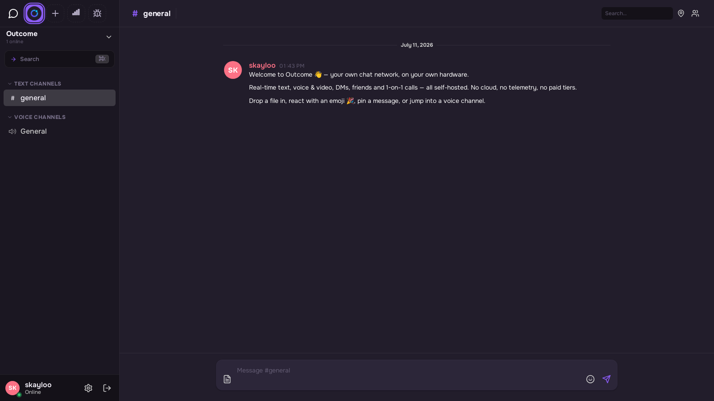
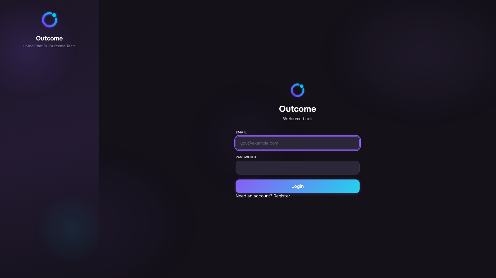
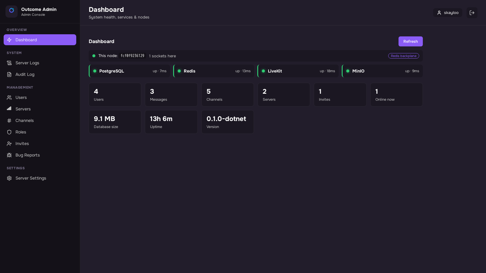

# Outcome

*Живой чат — твой сервер, твои правила.*

**🇬🇧 [Read in English → README.md](README.md)**

> **Ранняя альфа.** Outcome активно разрабатывается и ещё не закалён для продакшена.
> Пока не используйте его для чувствительной переписки. Багрепорты очень приветствуются —
> заводите issue прямо здесь.

**Outcome** — self-hosted чат-платформа в духе Discord, которая целиком работает на
**вашем** железе: без облаков, **без телеметрии**, без платных тарифов. Этот репозиторий —
**комплект развёртывания**: один compose-файл + готовые Docker-образы. Ничего не нужно
собирать из исходников — рабочий инстанс поднимается одной командой `docker compose up -d`.

<p align="center">
  
</p>
<p align="center">
  
  
</p>

## Почему Outcome

- **Всё в реальном времени** — сообщения по WebSocket: ответы, реакции, закрепы,
  индикаторы набора, отметки прочтения, полнотекстовый поиск, загрузка файлов
  перетаскиванием.
- **Голосовые и видео-каналы** — групповой голос, камеры, демонстрация экрана
  (LiveKit SFU) со **сквозным шифрованием медиа-кадров**: сервер пересылает только
  непрозрачные пакеты.
- **Гостевые ссылки в голос** — позвать человека в голосовой канал по ссылке, без
  регистрации.
- **E2EE личные сообщения** — NaCl box (Curve25519); сервер хранит только шифротекст,
  а зашифрованный бэкап ключей переносит историю на новое устройство.
- **Звонки один на один** — «телефонный» экран входящего звонка; звонок офлайн-другу
  ждёт и доставляется, как только он откроет приложение.
- **Настоящее нативное мобильное приложение** для iOS и Android — не обёртка над
  браузером: голосовые каналы, E2EE-звонки и переписка, push-to-talk — весь функционал в
  кармане. Релизы в сторы на подходе; приложение подключается к любому self-hosted
  инстансу по адресу.
- **Мультиинстансный веб-клиент** — на экране входа есть выбор сервера (как homeserver
  в Matrix): один веб-клиент умеет заходить на любой инстанс Outcome.
- **Роли, права, инвайты, модерация** — битовые права в семантике Discord с
  переопределениями на канал; регистрация по инвайтам, если хотите закрытый сервер.
- **Веб-админка** — пользователи, роли, аудит-лог, живые логи сервера, метрики,
  багрепорты.
- **Защита входа** — 2FA (TOTP/почта), хэширование паролей Argon2id, управление
  сессиями с кнопкой «отозвать все», опциональный вход через Google/Яндекс.
- **Масштабируется в обе стороны** — в простое меньше 2 ГБ RAM; API stateless и
  реплицируется за PgBouncer + Redis, когда нужно больше.

Всё вокруг двух образов Outcome — стандартный опенсорс из публичных реестров:

| Компонент | Роль |
|---|---|
| [`skayloo/outcome-server`](https://hub.docker.com/r/skayloo/outcome-server) | **API Outcome** (.NET) — REST, WebSocket, голосовой сигналинг |
| [`skayloo/outcome-frontend`](https://hub.docker.com/r/skayloo/outcome-frontend) | **Веб-приложение Outcome** (React) за nginx |
| [caddy-docker-proxy](https://github.com/lucaslorentz/caddy-docker-proxy) | Edge TLS, автоматический Let's Encrypt |
| [PostgreSQL 16](https://hub.docker.com/_/postgres) + [PgBouncer](https://hub.docker.com/r/edoburu/pgbouncer) | База + пул соединений |
| [Redis](https://hub.docker.com/_/redis) | Реалтайм-рассылка между репликами API |
| [MinIO](https://hub.docker.com/r/minio/minio) | Файлы (загрузки шифруются на диске, AES-256-GCM) |
| [LiveKit](https://hub.docker.com/r/livekit/livekit-server) | Голос/видео SFU (WebRTC) |
| [docker-mailserver](https://github.com/docker-mailserver/docker-mailserver) | *Опционально:* свои почтовые ящики + почта приложения |

## Требования

- Linux-хост (x86_64) с **публичным IP**. Для старта хватит 2 vCPU / 4 ГБ RAM.
- **Docker Engine** 24+ с compose-плагином (`docker compose version` должен работать).
- **Домен** под вашим управлением.
- Открытые (или проброшенные, если за NAT) порты:

  | Порт | Зачем |
  |---|---|
  | 80, 443 tcp (+ 443 udp) | Веб, API, WebSocket, HTTP/3 |
  | 7881 tcp | Голос/видео — TCP-фолбэк |
  | 7882 udp | Голос/видео — основной путь |
  | 25, 465, 587, 993 tcp | Только если включаете встроенную почту |

## DNS

Направьте записи на IP сервера **до** запуска (Caddy должен зарезолвить домен, чтобы
получить сертификаты):

| Запись | Значение |
|---|---|
| `A` `@` (или ваш поддомен) | IP сервера |
| `A` `www` | IP сервера |

## Быстрый старт

```bash
git clone https://github.com/Skayloo/Outcome.git
cd Outcome
cp .env.example .env
nano .env          # заполните всё — файл объясняет каждое значение и как генерировать секреты
docker compose up -d
```

Первый запуск занимает минуту-две: инициализируется Postgres, накатываются миграции
(безопасно даже с несколькими репликами API — они сериализуются через advisory lock),
Caddy получает сертификаты.

Откройте `https://ваш-домен` — **мастер первого запуска** создаст аккаунт владельца и
выдаст бессрочный инвайт-код для друзей. Регистрация по инвайтам: ссылки-приглашения
раздаются из приложения, остальное — в админ-консоли.

Мобильное приложение подключается к вашему инстансу так же — введите свой домен в поле
**«Сменить сервер»** на экране входа.

## Голос и видео

- `LIVEKIT_NODE_IP` в `.env` **обязан** быть публичным IP сервера — он объявляется
  браузерам для медиа-соединения (медиа идёт мимо HTTP-прокси).
- Открытый UDP `7882` = хорошие звонки. Если UDP закрыт, медиа падает на TCP `7881`.
- Кадры голоса/видео **шифруются сквозным образом** между участниками; SFU пересылает
  только непрозрачные пакеты. Гостевые ссылки (вход в голосовой канал без аккаунта)
  работают из коробки.

## Почта (опционально)

Без почты коды подтверждения регистрации печатаются в лог сервера
(`docker compose logs server | grep -i code`) — для знакомства с системой достаточно.

Для боевого инстанса либо укажите в `.env` любой внешний SMTP (`EMAIL_*`), либо
поднимите встроенный полноценный почтовый сервер (Postfix + Dovecot + rspamd + DKIM —
свои ящики на своём домене):

1. Добавьте DNS-записи:

   | Запись | Значение |
   |---|---|
   | `A` `mail` | IP сервера |
   | `MX` `@` | `mail.<домен>` (приоритет 10) |
   | `TXT` `@` | `v=spf1 mx -all` |
   | `TXT` `_dmarc` | `v=DMARC1; p=quarantine; rua=mailto:admin@<домен>` |

2. Запустите (при первом старте контейнер может пару раз перезапуститься, пока Caddy
   получает сертификат почтового хоста — это нормально):

   ```bash
   docker compose --profile mail up -d
   ```

3. Создайте отправляющий аккаунт приложения и свой ящик:

   ```bash
   docker compose exec mailserver setup email add no-reply@<домен>
   docker compose exec mailserver setup email add you@<домен>
   ```

4. Сгенерируйте DKIM-ключи и опубликуйте напечатанную TXT-запись:

   ```bash
   docker compose exec mailserver setup config dkim keysize 2048
   cat mail-config/opendkim/keys/<домен>/mail.txt   # → опубликовать как DNS TXT
   docker compose restart mailserver
   ```

5. Направьте приложение на почту в `.env` (`EMAIL_HOST=mail.<домен>`, порт 587,
   `EMAIL_USE_SSL=false`, логин/пароль no-reply аккаунта), затем
   `docker compose up -d server`.

6. **Попросите хостера прописать PTR (обратный DNS)** вашего IP на `mail.<домен>` —
   без этого большинство провайдеров кладёт письма в спам или отклоняет их. Проверить
   себя можно на [mail-tester.com](https://www.mail-tester.com).

Ящик читается любым IMAP-клиентом: хост `mail.<домен>`, порт 993 (SSL), SMTP 465/587.

## Обновление

```bash
docker compose pull
docker compose up -d
```

Миграции базы накатываются автоматически при старте API. Закрепите `OUTCOME_TAG` в
`.env`, если предпочитаете явные версии вместо `latest`.

## Бэкапы

Всё состояние лежит в именованных Docker-томах: `pgdata` (база), `minio_data`
(загруженные файлы), `maildata`/`mailstate` (почта, если включена), `caddy_data`
(сертификаты).

Консистентный дамп базы без остановки чего-либо:

```bash
docker compose exec postgres pg_dump -U outcome -Fc outcome > outcome-$(date +%F).dump
```

Сохраните и `.env` — особенно `MINIO_ENC_KEY`: загруженные файлы зашифрованы этим
ключом и без него нечитаемы.

## Масштабирование

API stateless и уже работает в несколько реплик (`SERVER_REPLICAS`); PgBouncer
мультиплексирует соединения к базе, Redis раздаёт реалтайм-события между репликами —
обычно достаточно поднять число реплик на машине пожирнее.

## Благодарности

Outcome стоит на плечах отличного опенсорса. Помимо компонентов стека из таблицы выше,
отдельное спасибо
[**pabloFuente/livekit-server-sdk-dotnet**](https://github.com/pabloFuente/livekit-server-sdk-dotnet) —
.NET SDK для LiveKit, на котором в Outcome работают голосовые токены, управление
комнатами и вебхуки.

## Лицензия

Содержимое этого репозитория (compose-файл, конфигурация, документация) — под MIT, см.
[LICENSE](LICENSE).

Docker-образы `outcome-server` и `outcome-frontend` содержат проприетарное ПО:
**их можно бесплатно скачивать и разворачивать для любых личных и коммерческих целей**,
но декомпилировать, модифицировать и распространять образы или их содержимое нельзя.
Исходный код не публикуется.
